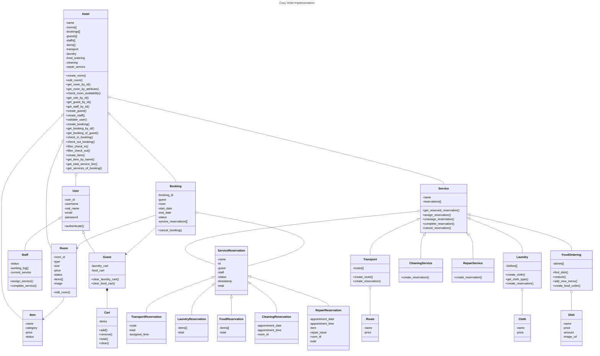

```mermaid
---
title: Cozy Hotel Implementation
---
classDiagram

    Hotel o-- Room
    Hotel o-- Booking
    Hotel o-- User
    Hotel o-- Item
    Hotel o-- Service
    User <|-- Staff
    User <|-- Guest
    Booking --> Guest
    Booking --> Room
    Room --> Item
    Service <|-- Transport
    Service <|-- Laundry
    Service <|-- FoodOrdering
    Service <|-- CleaningService
    Service <|-- RepairService
    ServiceReservation <|-- TransportReservation
    ServiceReservation <|-- LaundryReservation
    ServiceReservation <|-- FoodReservation
    ServiceReservation <|-- CleaningReservation
    ServiceReservation <|-- RepairReservation
    Service o-- ServiceReservation
    Guest *-- Cart
    Transport o-- Route
    Laundry o-- Cloth
    FoodOrdering o-- Dish
    Booking o-- ServiceReservation

    class Hotel{
        -name
        -rooms[]
        -bookings[]
        -guests[]
        -staffs[]
        -items[]
        -transport
        -laundry
        -food_ordering
        -cleaning
        -repair_service
        +create_room()
        +edit_room()
        +get_room_by_id()
        +get_room_by_attribute()
        +check_room_availability()
        +get_role_by_id()
        +get_guest_by_id()
        +get_staff_by_id()
        +create_guest()
        +create_staff()
        +validate_user()
        +create_booking()
        +get_booking_by_id()
        +get_booking_of_guest()
        +check_in_booking()
        +check_out_booking()
        +filter_check_in()
        +filter_check_out()
        +create_item()
        +get_item_by_name()
        +get_total_service_fee()
        +get_services_of_booking()
    }

    class User{
        -user_id
        -username
        -real_name
        -email
        -password
        +authenticate()
    }

    class Guest{
        -laundry_cart
        -food_cart
        +clear_laundry_cart()
        +clear_food_cart()
    }

    class Staff{
        -status
        -working_log[]
        -current_service
        +assign_service()
        +complete_service()
    }

    class Room{
        -room_id
        -type
        -size
        -price
        -status
        -items[]
        -image
        +edit_room()
    }

    class Item{
        -name
        -category
        -price
        -status
    }

    class Booking{
        -booking_id
        -guest
        -room
        -start_date
        -end_date
        -status
        -service_reservations[]
        +cancel_booking()
    }

    class Cart{
        -items
        +add()
        +remove()
        +total()
        +clear()
    }

    class Service{
        -name
        -reservations[]
        +get_reserved_reservation()
        +assign_reservation()
        +unassign_reservation()
        +complete_reservation()
        +cancel_reservation()
    }

    class ServiceReservation{
        -name
        -id
        -guest
        -staff
        -status
        -timestamp
        -total
    }

    class Transport{
        -routes[]
        +create_route()
        +create_reservation()
    }

    class TransportReservation{
        -route
        -total
        -assigned_time
    }

    class Route{
        -name
        -price
    }

    class Laundry{
        -clothes[]
        +create_cloth()
        +get_cloth_type()
        +create_reservation()
    }

    class LaundryReservation{
        -items[]
        -total
    }

    class Cloth{
        -name
        -price
    }

    class FoodOrdering{
        -dishes[]
        +find_dish()
        +restock()
        +add_new_menu()
        +create_food_order()
    }

    class FoodReservation{
        -items[]
        -total
    }

    class Dish{
        -name
        -price
        -amount
        -image_url
    }

    class CleaningService{
        +create_reservation()
    }

    class CleaningReservation{
        -appointment_date
        -appointment_time
        -room_id
    }

    class RepairService{
        +create_reservation()
    }

    class RepairReservation{
        -appointment_date
        -appointment_time
        -item
        -repair_issue
        -room_id
        -total
    }
```
