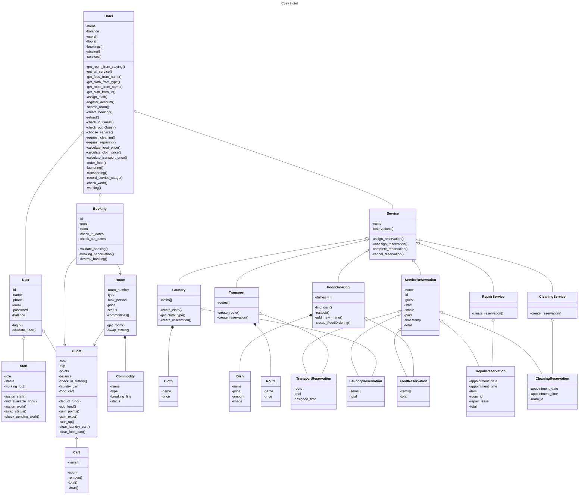

```mermaid
---
title: Cozy Hotel
---
classDiagram

    Hotel o-- User
    Hotel o-- Booking
    Hotel o-- Service
    User <|-- Staff
    User <|-- Guest
    Booking --> Guest
    Booking --> Room
    Room --> Guest
    Room *-- Commodity
    Service <|-- Laundry
    Laundry *-- Cloth 
    Service <|-- FoodOrdering
    FoodOrdering *-- Dish
    Service <|-- Transport
    Transport *-- Route
    Service <|-- RepairService
    Service <|-- CleaningService
    ServiceReservation <|-- TransportReservation
    ServiceReservation <|-- LaundryReservation
    ServiceReservation <|-- FoodReservation
    ServiceReservation <|-- RepairReservation
    ServiceReservation <|-- CleaningReservation
    Service o-- ServiceReservation
    Transport o-- TransportReservation
    Laundry o-- LaundryReservation
    FoodOrdering o-- FoodReservation
    RepairService o-- RepairReservation
    CleaningService o-- CleaningReservation
    Guest <-- Cart
 

    class Hotel{
        -name
        -balance
        -users[]
        -floors[]
        -bookings[]
        -staying[]

        -services[]
        -get_room_from_staying()
        -get_all_service()
        -get_food_from_name()
        -get_cloth_from_type()
        -get_route_from_name()
        -get_staff_from_id()
        -assign_staff()

        -register_account()
        -search_room()
        -create_booking()
        -refund()

        -check_in_Guest()
        -check_out_Guest()

        -choose_service()
        -request_cleaning()
        -request_repairing()
        -calculate_food_price()
        -calculate_cloth_price()
        -calculate_transport_price()
        -order_food()
        -laundring()
        -transporting()
        -record_service_usage()

        -check_work()
        -working()
    }
    class User{
        -id
        -name
        -phone
        -email
        -password
        -balance
        -login()
        -validate_user()
    }
    class Guest{
        -rank
        -exp
        -points
        -balance
        -check_in_history[]
        -laundry_cart
        -food_cart
        -deduct_fund()
        -add_fund()
        -gain_points()
        -gain_exps()
        -rank_up()
        -clear_laundry_cart()
        -clear_food_cart()
    }
    class Staff{
        -role
        -status
        -working_log[]
        -assign_staff()
        -find_available_right()
        -assign_work()
        -swap_status()
        -check_pending_work()
    }
    class Room{
        -room_number
        -type
        -max_person
        -price
        -status
        -commodities[]
        -get_room()
        -swap_status()
    }
    class Commodity{
        -name
        -type
        -breaking_fine
        -status
    }
    class Booking{
        -id
        -guest
        -room
        -check_in_dates
        -check_out_dates
        -validate_booking()
        -booking_cancellation()
        -destroy_booking()
    }
    class Service{
        -name
        -reservations[]
        -assign_reservation()
        -unassign_reservation()
        -complete_reservation()
        -cancel_reservation()

    }
    class Laundry{
        -cloths[]
        -create_cloth()
        -get_cloth_type()
        -create_reservation()
    }
    class Cloth{
        -name
        -price
    }
    class FoodOrdering{
        -dishes = []
        -find_dish()
        -restock()
        -add_new_menu()
        -create_FoodOrdering()

    }
    class Dish{
        -name
        -price
        -amount
        -image
    }
    class Transport{
        -routes[]
        -create_route()
        -create_reservation()

    }
    class Route{
        -name
        -price
    }
    class CleaningService{
        -create_reservation()
    }
    class RepairService{
        -create_reservation()
    }
    class ServiceReservation{
        -name
        -id
        -guest
        -staff
        -status
        -paid
        -timestamp
        -total
    }
    class TransportReservation{
        -route
        -total
        -assigned_time
    }
    class LaundryReservation{
        -items[]
        -total
    }
    class FoodReservation{
        -items[]
        -total
    }
    class CleaningReservation{
        -appointment_date
        -appointment_time
        -room_id
    }
    class RepairReservation{
        -appointment_date
        -appointment_time
        -item
        -room_id
        -repair_issue
        -total
    }
    class Cart{
        -items[]
        -add()
        -remove()
        -total()
        -clear()
    }

```
