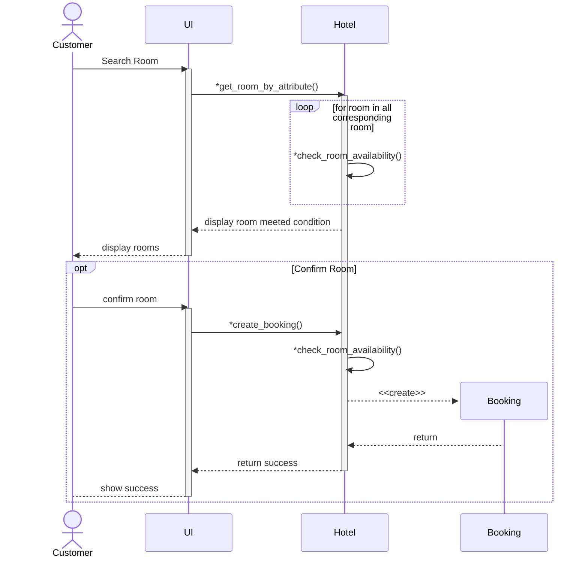

# Booking(Home)

*get_room_by_attribute(room_type,  guest_count, max_budget_perday, start_date, end_date)

*check_room_availability(room_id, start_date, end_date)

*create_booking(user, room, start_date, end_date)

