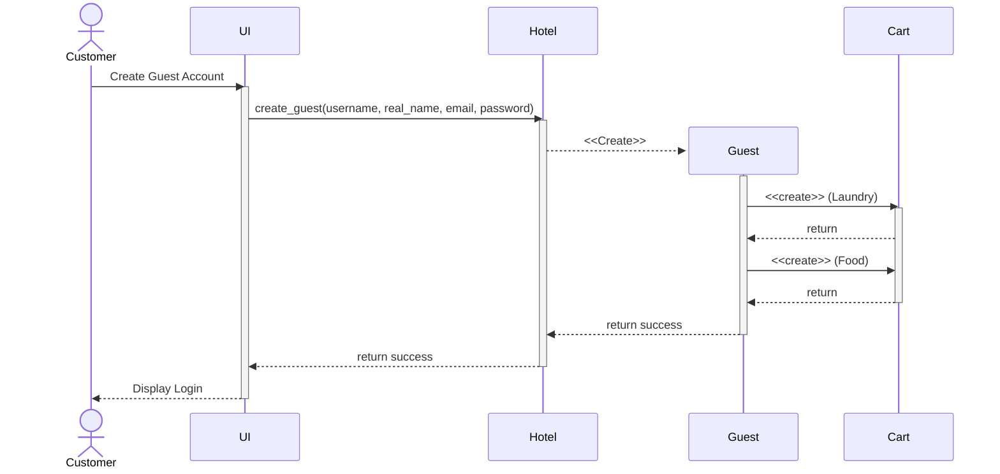

# Create Guest Account

```mermaid
sequenceDiagram
    actor Customer

    Customer->>UI: Create Guest Account
    activate UI

    UI->>Hotel: create_guest(username, real_name, email, password)
    activate Hotel

    create participant Guest
    Hotel-->>Guest: <<Create>>
    activate Guest

    Guest->>Cart: <<create>> (Laundry)
    activate Cart
    Cart-->>Guest: return

    Guest->>Cart: <<create>> (Food)
    Cart-->>Guest: return
    deactivate Cart

    Guest-->>Hotel: return success
    deactivate Guest

    Hotel-->>UI: return success
    deactivate Hotel

    UI-->>Customer: Display Login
    deactivate UI

```