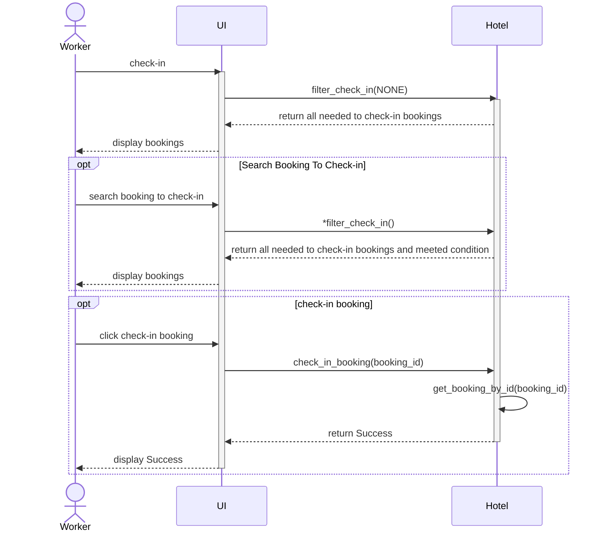

# Check-in (check-in board)

```mermaid
sequenceDiagram
    actor Worker

    Worker->>UI: check-in
    activate UI

    UI->>Hotel: filter_check_in(NONE)
    activate Hotel

    Hotel-->>UI: return all needed to check-in bookings

    UI-->>Worker: display bookings

    opt Search Booking To Check-in
        Worker->>UI: search booking to check-in

        UI->>Hotel: *filter_check_in()

        Hotel-->>UI: return all needed to check-in bookings and meeted condition

        UI-->>Worker: display bookings
    end

    opt check-in booking
        Worker->>UI: click check-in booking

        UI->>Hotel: check_in_booking(booking_id)

        Hotel->>Hotel: get_booking_by_id(booking_id)

        Hotel-->>UI: return Success
        deactivate Hotel

        UI-->>Worker: display Success
        deactivate UI

    end
```

*filter_check_in(self, room_id, guest_name, check_in_date, check_out_date)