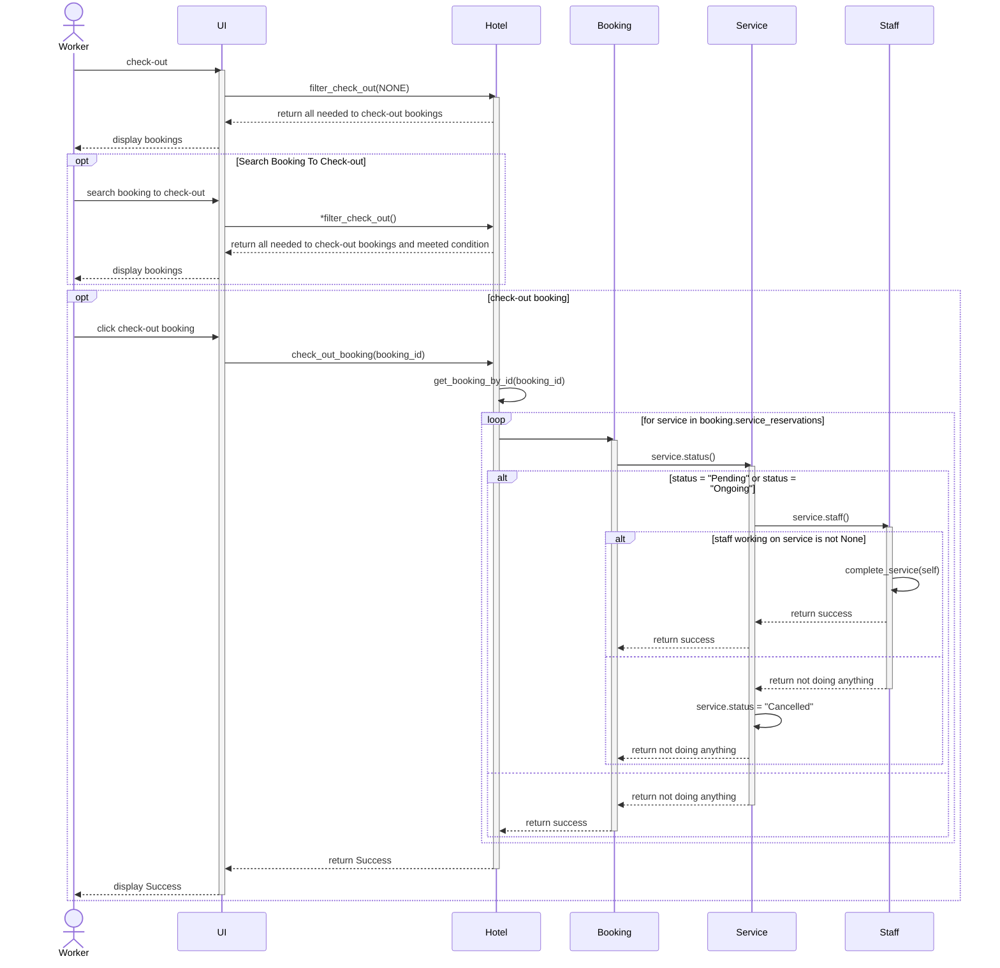

# Check-out (check-out board)

```mermaid
sequenceDiagram
    actor Worker

    Worker->>UI: check-out
    activate UI

    UI->>Hotel: filter_check_out(NONE)
    activate Hotel

    Hotel-->>UI: return all needed to check-out bookings

    UI-->>Worker: display bookings

    opt Search Booking To Check-out
        Worker->>UI: search booking to check-out

        UI->>Hotel: *filter_check_out()

        Hotel-->>UI: return all needed to check-out bookings and meeted condition

        UI-->>Worker: display bookings
    end

    opt check-out booking
        Worker->>UI: click check-out booking

        UI->>Hotel: check_out_booking(booking_id)

        Hotel->>Hotel: get_booking_by_id(booking_id)


        loop for service in booking.service_reservations
            Hotel->>Booking: 
            activate Booking

            Booking->>Service: service.status()
            activate Service


            alt status = "Pending" or status = "Ongoing"
                Service->>Staff: service.staff()
                activate Staff
                    
                    
                alt staff working on service is not None
                    Staff->>Staff: complete_service(self)

                    Staff-->>Service: return success

                    Service-->>Booking: return success
                else

                    Staff-->>Service: return not doing anything
                    deactivate Staff

                    Service->>Service: service.status = "Cancelled"

                    Service-->>Booking: return not doing anything
                end
            
            else
                Service-->>Booking: return not doing anything
                deactivate Service

                Booking-->>Hotel: return success
                deactivate Booking

            end

        end


        Hotel-->>UI: return Success
        deactivate Hotel

        UI-->>Worker: display Success
        deactivate UI

    end
```

*filter_check_out(self, room_id, guest_name, check_in_date, check_out_date)