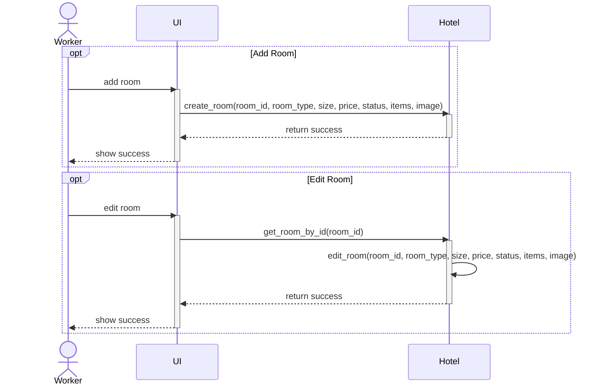

# Room Management (Room Management-page)

```mermaid
sequenceDiagram
    actor Worker


    opt Add Room
        Worker->>UI: add room
        activate UI

        UI->>Hotel: create_room(room_id, room_type, size, price, status, items, image)
        activate Hotel

        Hotel-->>UI: return success
        deactivate Hotel
        
        UI-->>Worker: show success
        deactivate UI

    end
    
    opt Edit Room
        Worker->>UI: edit room
        activate UI

        UI->>Hotel: get_room_by_id(room_id)
        activate Hotel

        Hotel->>Hotel: edit_room(room_id, room_type, size, price, status, items, image)

        Hotel-->>UI: return success
        deactivate Hotel

        UI-->>Worker: show success
        deactivate UI

    end
```