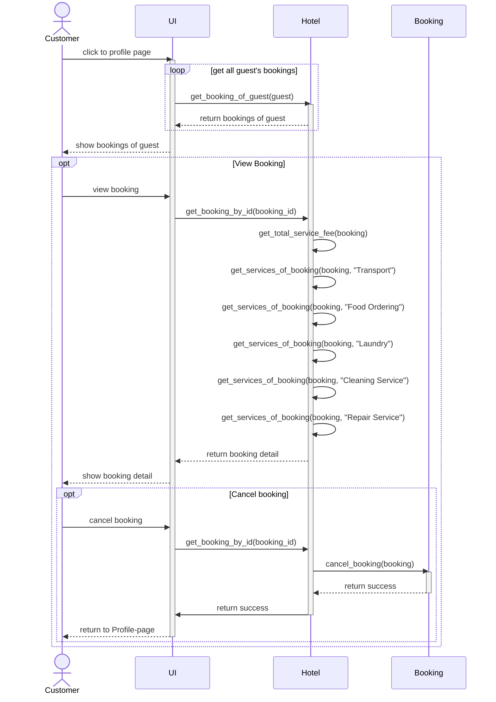

# Booking View (Profile-page)

```mermaid
sequenceDiagram
    actor Customer
    

    Customer->>UI: click to  profile page
    activate UI

    loop get all guest's bookings
        UI->>Hotel: get_booking_of_guest(guest)
        activate Hotel

        Hotel-->>UI: return bookings of guest
    end

    UI-->>Customer: show bookings of guest


    opt View Booking

        Customer->>UI: view booking

        UI->>Hotel: get_booking_by_id(booking_id)

        Hotel->>Hotel: get_total_service_fee(booking)

        Hotel->>Hotel: get_services_of_booking(booking, "Transport")

        Hotel->>Hotel: get_services_of_booking(booking, "Food Ordering")

        Hotel->>Hotel: get_services_of_booking(booking, "Laundry")

        Hotel->>Hotel: get_services_of_booking(booking, "Cleaning Service")

        Hotel->>Hotel: get_services_of_booking(booking, "Repair Service")

        Hotel-->>UI: return booking detail

        UI-->>Customer: show booking detail


        opt Cancel booking
            Customer->>UI: cancel booking

            UI->>Hotel: get_booking_by_id(booking_id)
            
            Hotel->>Booking: cancel_booking(booking)
            activate Booking

            Booking-->>Hotel: return success
            deactivate Booking

            Hotel->>UI: return success
            deactivate Hotel
            
            UI-->>Customer: return to Profile-page
            deactivate UI

        end
    end
        
```