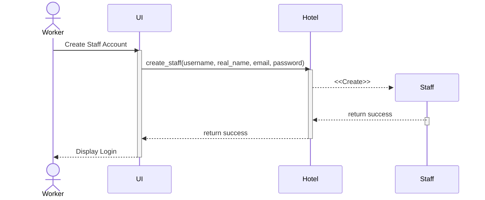

# Create new staff account

```mermaid
sequenceDiagram
    actor Worker

    Worker->>UI: Create Staff Account
    activate UI

    UI->>Hotel: create_staff(username, real_name, email, password)
    activate Hotel

    create participant Staff
    Hotel-->>Staff: <<Create>>

    Staff-->>Hotel: return success
    activate Staff
    deactivate Staff

    Hotel-->>UI: return success
    deactivate Hotel

    UI-->>Worker: Display Login
    deactivate UI
    
```