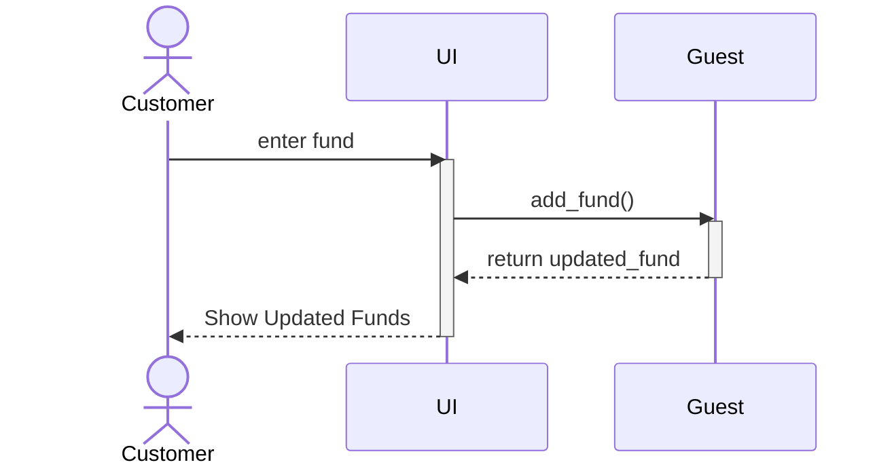

# Adding Fund in account

```mermaid
sequenceDiagram
    actor Customer
    Customer->>UI: enter fund
    activate UI
    UI->>Guest: add_fund()
    activate Guest
    Guest-->>UI: return updated_fund
    deactivate Guest
    UI-->>Customer: Show Updated Funds
    deactivate UI
```