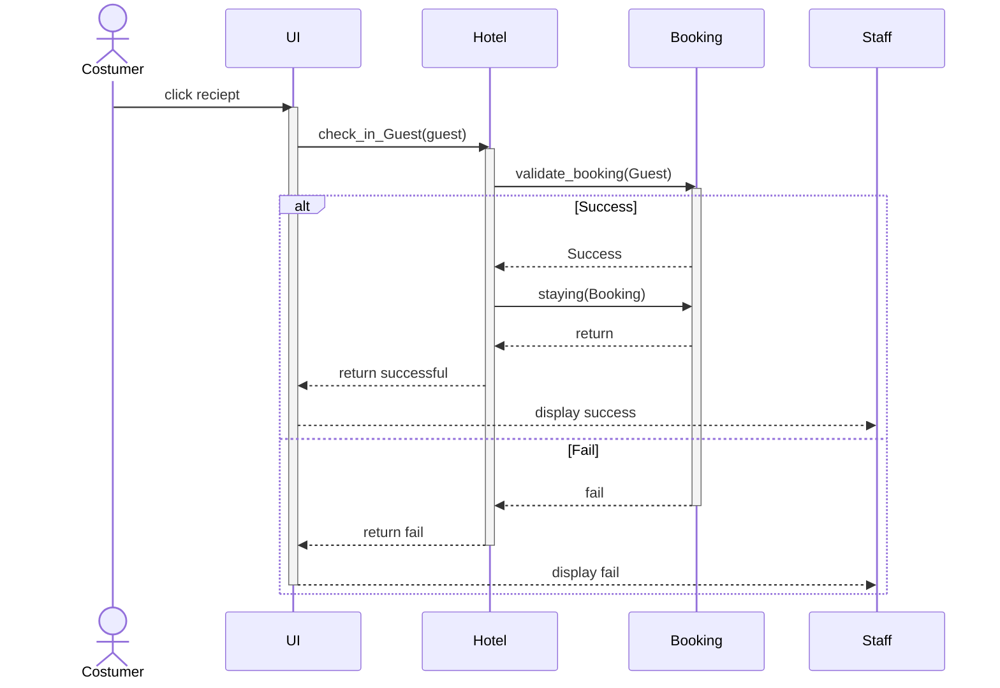

# service_payment (Profile)

```mermaid
sequenceDiagram
    actor Costumer

    Costumer->>UI: click reciept
    activate UI

    UI->>Hotel: check_in_Guest(guest)
    activate Hotel

    Hotel->>Booking: validate_booking(Guest)
    activate Booking


    alt Success
        Booking-->>Hotel: Success

        Hotel->>Booking: staying(Booking)

        Booking-->>Hotel: return

        Hotel-->>UI: return successful

        UI-->>Staff: display success
        
    else Fail
        Booking-->>Hotel: fail
        deactivate Booking

        Hotel-->>UI: return fail
        deactivate Hotel

        UI-->>Staff: display fail
        deactivate UI
    end

```