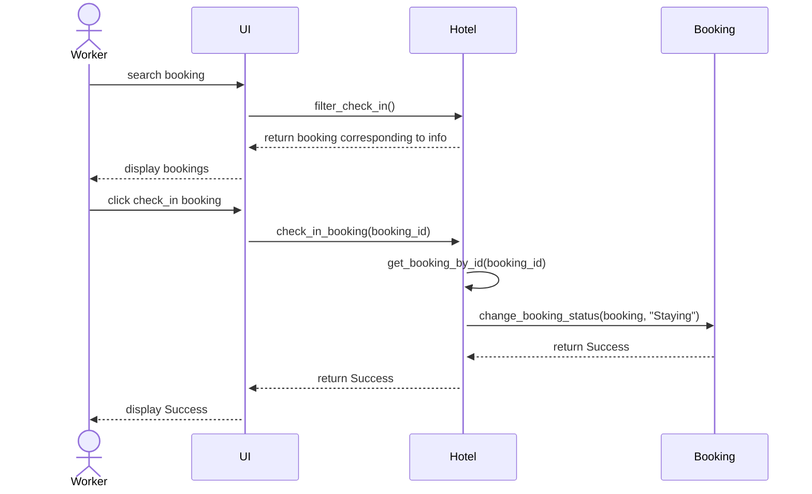

# Worker Check-in Booking (check_in board)

```mermaid
sequenceDiagram
    actor Worker

    Worker->>UI: search booking
    activate UI

    UI->>Hotel: filter_check_in()
    activate Hotel

    Hotel-->>UI: return booking corresponding to info

    UI-->>Worker: display bookings

    Worker->>UI: click check_in booking

    UI->>Hotel: check_in_booking(booking_id)

    Hotel->>Hotel: get_booking_by_id(booking_id)

    Hotel->>Booking: change_booking_status(booking, "Staying")

    Booking-->>Hotel: return Success

    Hotel-->>UI: return Success

    UI-->>Worker: display Success

```