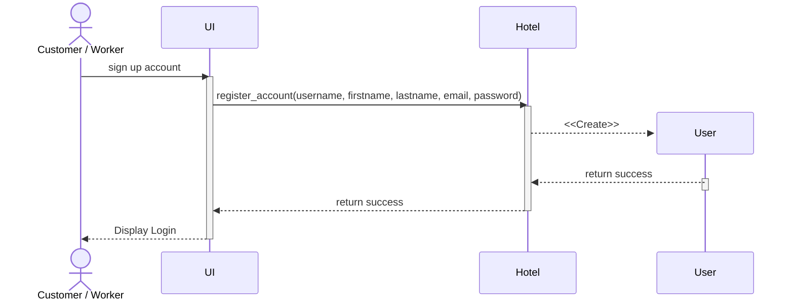

# Guest / Staff sign up

```mermaid
sequenceDiagram
    actor Customer / Worker
    Customer / Worker->>UI: sign up account
    activate UI
    UI->>Hotel: register_account(username, firstname, lastname, email, password)
    activate Hotel
    create participant User
    Hotel-->>User: <<Create>>
    User-->>Hotel: return success
    activate User
    deactivate User
    Hotel-->>UI: return success
    deactivate Hotel
    UI-->>Customer / Worker: Display Login
    deactivate UI
```