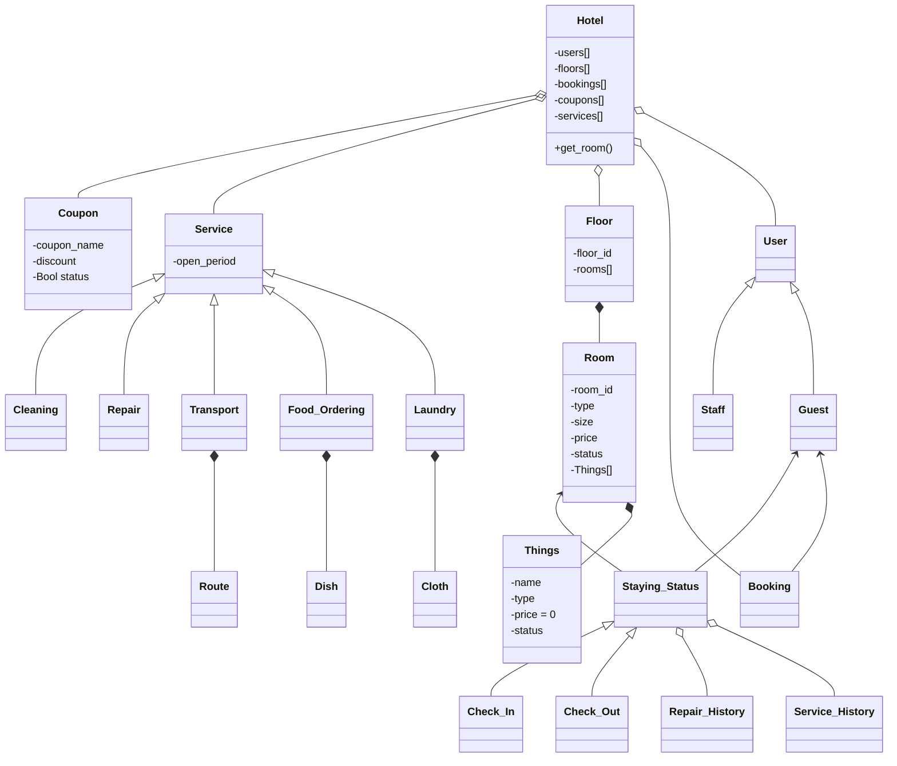

# Class Diagram

```mermaid
classDiagram 
    class Hotel {
        -users[]
        -floors[]
        -bookings[]
        -coupons[]
        -services[]
        +get_room()
    }
    class Coupon {
        -coupon_name
        -discount
        -Bool status
    }
    class Service {
        -open_period
    }
    class Floor {
        -floor_id
        -rooms[]
    }
    class Room {
        -room_id
        -type
        -size
        -price
        -status
        -Things[]
    }
    class Things {
        -name
        -type
        -price = 0
        -status
    }
    Hotel o-- Coupon
    Hotel o-- Service
    Hotel o-- Floor
    Hotel o-- Booking
    Hotel o-- User
    User <|-- Staff
    User <|-- Guest
    Guest <-- Staying_Status
    Guest <-- Booking
    Room <-- Staying_Status
    Room *-- Things
    Staying_Status <|-- Check_In
    Staying_Status <|-- Check_Out
    Staying_Status o-- Repair_History
    Staying_Status o-- Service_History
    Service <|-- Cleaning
    Service <|-- Repair
    Service <|-- Transport
    Service <|-- Food_Ordering
    Service <|-- Laundry
    Transport *-- Route
    Food_Ordering *-- Dish
    Laundry *-- Cloth 
    Floor *-- Room
```