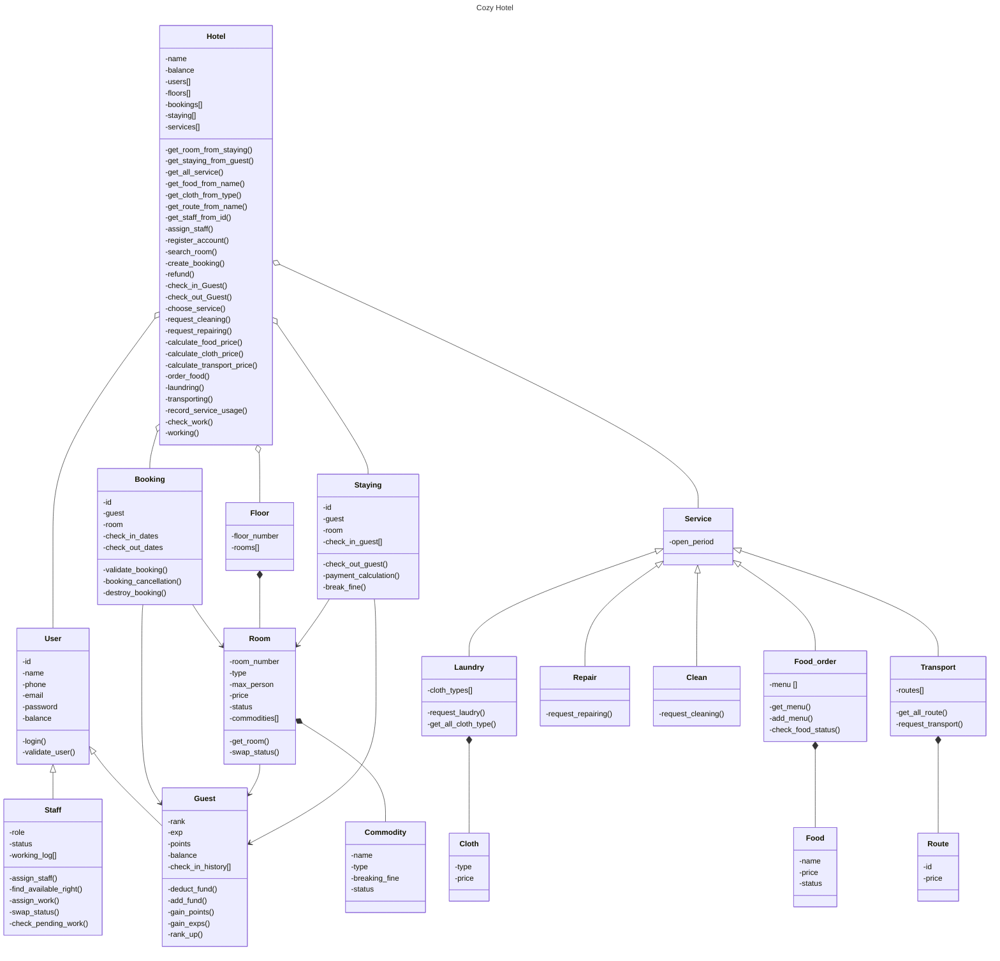

```mermaid
---
title: Cozy Hotel
---
classDiagram

    Hotel o-- User
    Hotel o-- Booking
    Hotel o-- Staying
    Hotel o-- Floor
    Hotel o-- Service
    User <|-- Staff
    User <|-- Guest
    Booking --> Guest
    Booking --> Room
    Room --> Guest
    Floor *-- Room
    Staying --> Guest
    Staying --> Room
    Room *-- Commodity
    Service <|-- Laundry
    Laundry *-- Cloth 
    Service <|-- Food_order
    Food_order *-- Food
    Service <|-- Transport
    Transport *-- Route
    Service <|-- Repair
    Service <|-- Clean
    
    class Hotel{
        -name
        -balance
        -users[]
        -floors[]
        -bookings[]
        -staying[]

        -services[]
        -get_room_from_staying()
        -get_staying_from_guest()
        -get_all_service()
        -get_food_from_name()
        -get_cloth_from_type()
        -get_route_from_name()
        -get_staff_from_id()
        -assign_staff()

        -register_account()
        -search_room()
        -create_booking()
        -refund()

        -check_in_Guest()
        -check_out_Guest()

        -choose_service()
        -request_cleaning()
        -request_repairing()
        -calculate_food_price()
        -calculate_cloth_price()
        -calculate_transport_price()
        -order_food()
        -laundring()
        -transporting()
        -record_service_usage()

        -check_work()
        -working()
    }
    class User{
        -id
        -name
        -phone
        -email
        -password
        -balance
        -login()
        -validate_user()
    }
    class Guest{
        -rank
        -exp
        -points
        -balance
        -check_in_history[]
        -deduct_fund()
        -add_fund()
        -gain_points()
        -gain_exps()
        -rank_up()
    }
    class Staff{
        -role
        -status
        -working_log[]
        -assign_staff()
        -find_available_right()
        -assign_work()
        -swap_status()
        -check_pending_work()
    }
    class Floor{
        -floor_number
        -rooms[]
    }
    class Room{
        -room_number
        -type
        -max_person
        -price
        -status
        -commodities[]
        -get_room()
        -swap_status()
    }
    class Commodity{
        -name
        -type
        -breaking_fine
        -status
    }
    class Booking{
        -id
        -guest
        -room
        -check_in_dates
        -check_out_dates
        -validate_booking()
        -booking_cancellation()
        -destroy_booking()
    }
    class Staying{
        -id
        -guest
        -room
        -check_in_guest[]
        -check_out_guest()
        -payment_calculation()
        -break_fine()
    }
    class Service{
        -open_period
    }
    class Laundry{
        -cloth_types[]
        -request_laudry()
        -get_all_cloth_type()
    }
    class Cloth{
        -type
        -price
    }
    class Food_order{
        -menu []
        -get_menu()
        -add_menu()
        -check_food_status()
    }
    class Food{
        -name
        -price
        -status
    }
    class Transport{
        -routes[]
        -get_all_route()
        -request_transport()
    }
    class Route{
        -id
        -price
    }
    class Clean{
        -request_cleaning()
    }
    class Repair{
        -request_repairing()
    }
```
