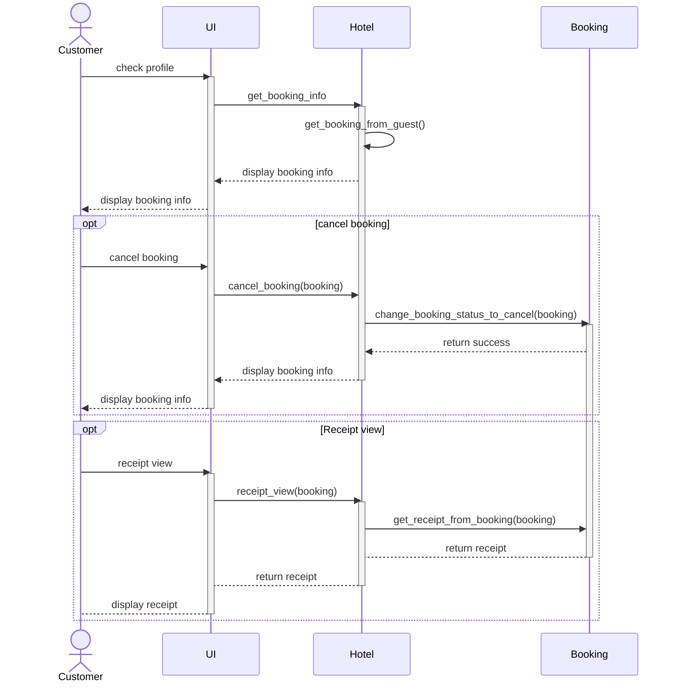

# Cancel booking & Receipt view(Home)

```mermaid
sequenceDiagram
    actor Customer

    Customer->>UI: check profile
    activate UI

    UI->>Hotel: get_booking_info
    activate Hotel

    Hotel->>Hotel: get_booking_from_guest()
    


    Hotel-->>UI: display booking info

    UI-->>Customer: display booking info

    
    opt cancel booking
        Customer->>UI: cancel booking
        
        UI->>Hotel: cancel_booking(booking)

        Hotel->>Booking: change_booking_status_to_cancel(booking)
        activate Booking

        Booking-->>Hotel: return success
        
        Hotel-->>UI: display booking info
        deactivate Hotel
        
        UI-->>Customer: display booking info
        deactivate UI
    
    end

    opt Receipt view
        Customer->>UI: receipt view
        activate UI

        UI->>Hotel: receipt_view(booking)
        activate Hotel

        Hotel->>Booking: get_receipt_from_booking(booking)

        Booking-->Hotel: return receipt
        deactivate Booking

        Hotel-->UI: return receipt
        deactivate Hotel

        UI-->Customer: display receipt
        deactivate UI

    end
        
```