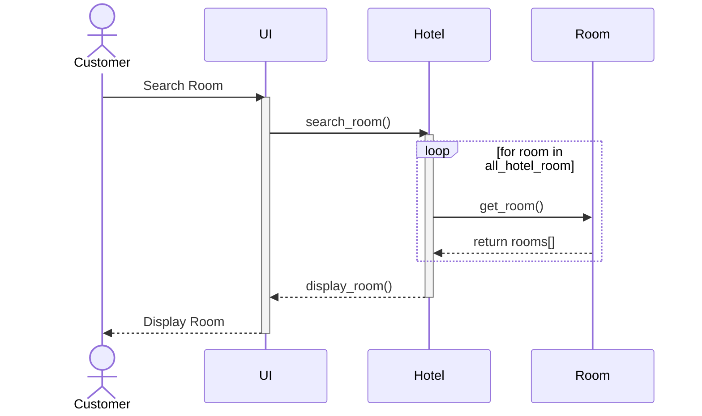
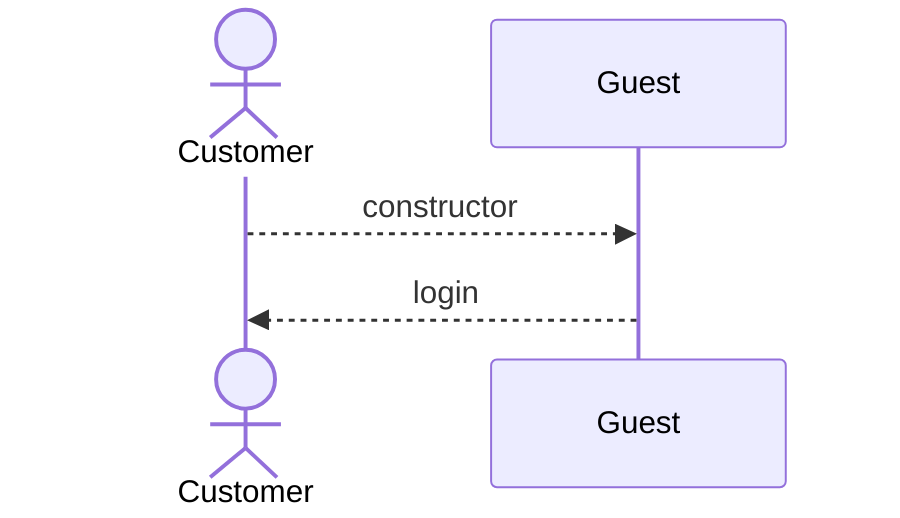
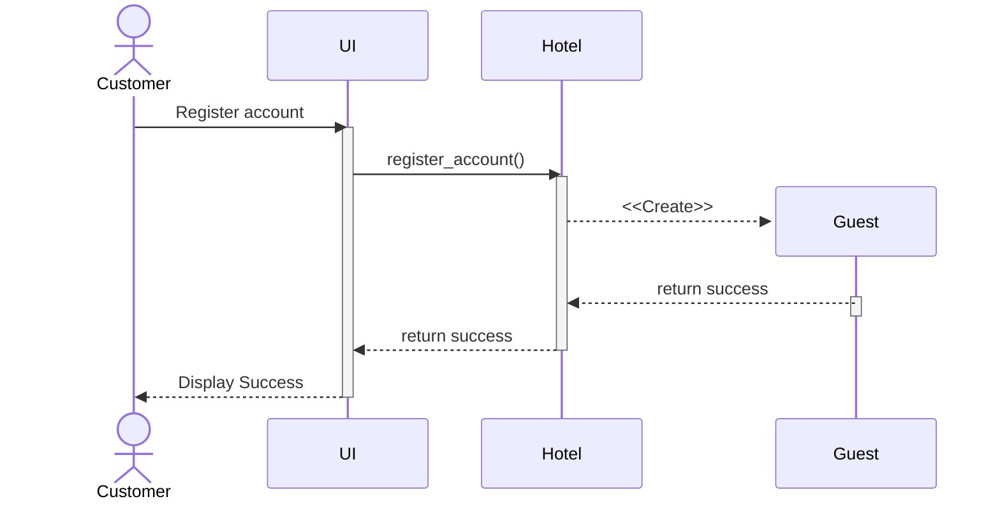
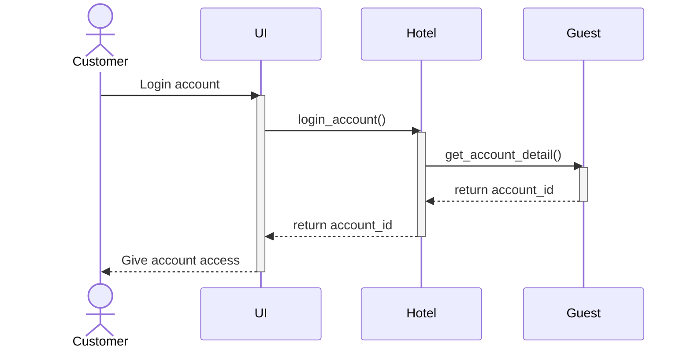
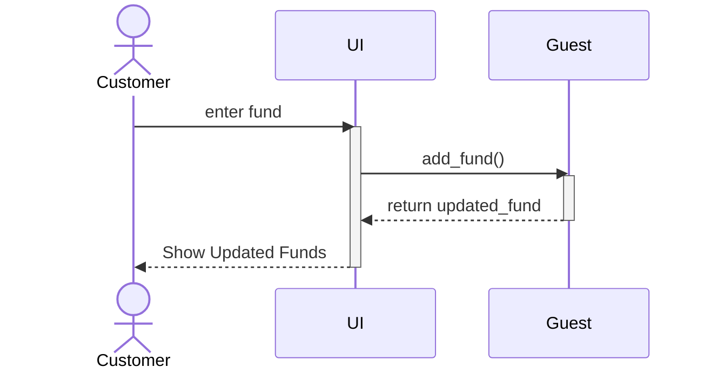
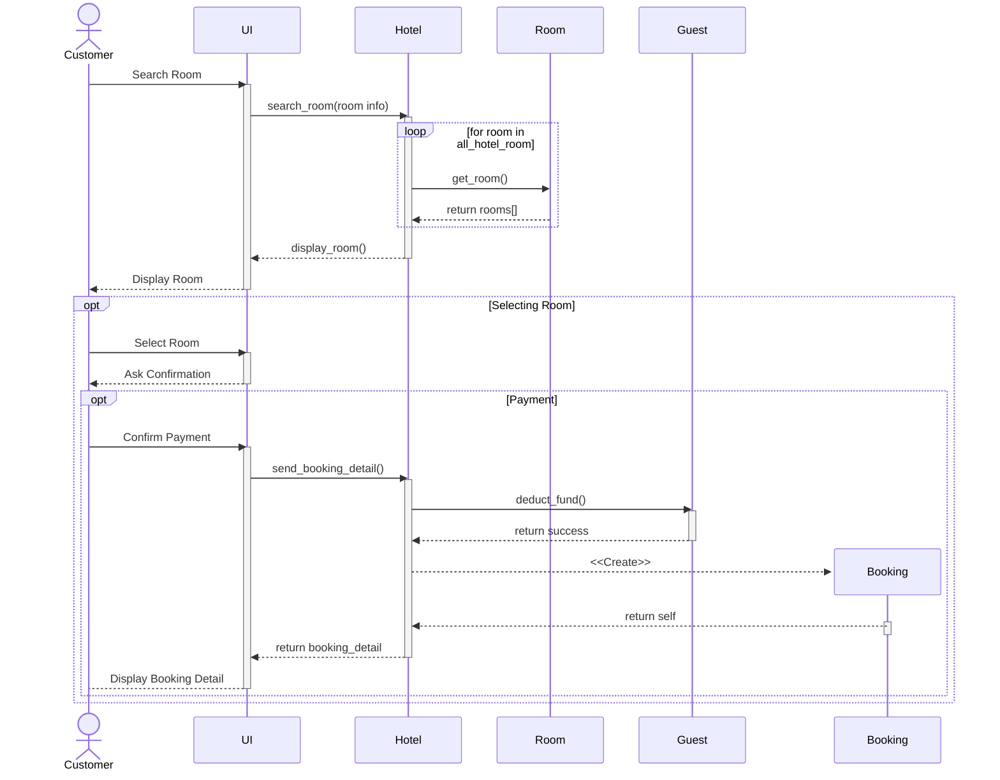
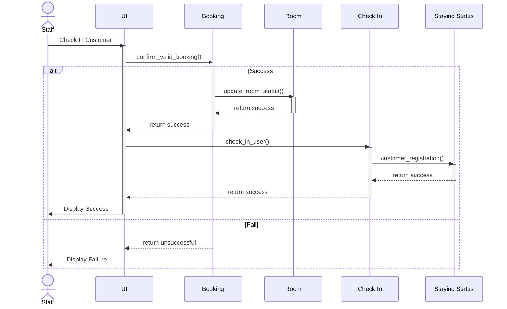

# Finding Hotel

```mermaid
sequenceDiagram
    actor Customer
    Customer->>UI: Search Room
    activate UI
    UI->>Hotel: search_room()
    activate Hotel
    loop for room in all_hotel_room
        Hotel->>Room:get_room()
        Room-->>Hotel:return rooms[]
    end
    Hotel-->>UI:display_room()
    deactivate Hotel
    UI-->>Customer:Display Room
    deactivate UI
```

---
# TEST TEST SEQ DIA IGNORE BELOW

```mermaid
sequenceDiagram
    actor Customer
    Customer-->>Guest: constructor
    Guest-->>Customer: login

```

# Guest Account Registration

```mermaid
sequenceDiagram
    actor Customer
    Customer->>UI: Register account
    activate UI
    UI->>Hotel: register_account()
    activate Hotel
    create participant Guest
    Hotel-->>Guest: <<Create>>
    Guest-->>Hotel: return success
    activate Guest
    deactivate Guest
    Hotel-->>UI: return success
    deactivate Hotel
    UI-->>Customer: Display Success
    deactivate UI
```

# Guest Login

```mermaid
sequenceDiagram
    actor Customer
    Customer->>UI: Login account
    activate UI
    %% UI->>UI: Check if data is all entered
    %% activate UI
    %% deactivate UI
    %% alt Incomplete Data
    %%    UI->>UI: Notify incomplete data
    %%    activate UI
    %%    deactivate UI
    %% end
    UI->>Hotel: login_account()
    activate Hotel
    Hotel->>Guest: get_account_detail()
    activate Guest
    Guest-->>Hotel: return account_id
    deactivate Guest
    Hotel-->>UI: return account_id
    deactivate Hotel
    UI-->>Customer: Give account access
    deactivate UI
```

# Adding Fund in account

```mermaid
sequenceDiagram
    actor Customer
    Customer->>UI: enter fund
    activate UI
    UI->>Guest: add_fund()
    activate Guest
    Guest-->>UI: return updated_fund
    deactivate Guest
    UI-->>Customer: Show Updated Funds
    deactivate UI
```

# Finding Hotel and Book

```mermaid
sequenceDiagram
    actor Customer
    Customer->>UI: Search Room
    activate UI
    UI->>Hotel: search_room(room info)
    activate Hotel
    loop for room in all_hotel_room
        Hotel->>Room:get_room()
        Room-->>Hotel:return rooms[]
    end
    Hotel-->>UI:display_room()
    deactivate Hotel
    UI-->>Customer:Display Room
    deactivate UI
    opt Selecting Room
        Customer->>UI:Select Room
        activate UI
        UI-->>Customer:Ask Confirmation
        deactivate UI
        opt Payment
            Customer->>UI: Confirm Payment
            %% opt Coupon
            %%    Customer->>UI: Enter Coupon
            %%    UI->>Hotel: verify_coupon()
            %%    alt Coupon Status
            %%        Hotel-->>UI: return discount
            %%        UI-->>Customer: Show Discount
            %%    end
            %% end
            activate UI
            UI->>Hotel: send_booking_detail()
            activate Hotel
            Hotel->>Guest: deduct_fund()
            activate Guest
            Guest-->>Hotel: return success
            deactivate Guest
            create participant Booking
            Hotel-->>Booking: <<Create>>
            Booking-->>Hotel: return self
            activate Booking
            deactivate Booking
            Hotel-->>UI: return booking_detail
            deactivate Hotel
            UI-->Customer: Display Booking Detail
            deactivate UI
        end
    end
    
```

# Staff Check in

```mermaid
sequenceDiagram
    actor Staff
    Staff->>UI: Check In Customer
    activate UI
    UI->>Booking: confirm_valid_booking()
    activate Booking
    alt Success
        Booking->>Room: update_room_status()
        activate Room
        Room-->>Booking: return success
        deactivate Room
        Booking-->>UI: return success
        deactivate Booking
        UI->>Check In: check_in_user()
        activate Check In
        Check In->>Staying Status: customer_registration()
        activate Staying Status
        Staying Status-->>Check In: return success
        deactivate Staying Status
        Check In-->>UI: return success
        deactivate Check In
        UI-->>Staff: Display Success
        deactivate UI
    else Fail
        Booking-->>UI: return unsuccessful
        UI-->>Staff: Display Failure
    end

```

